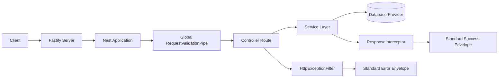
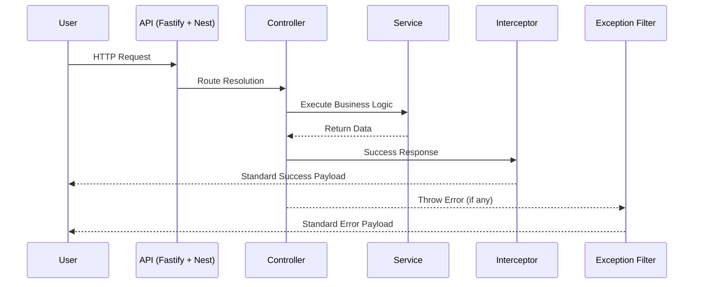
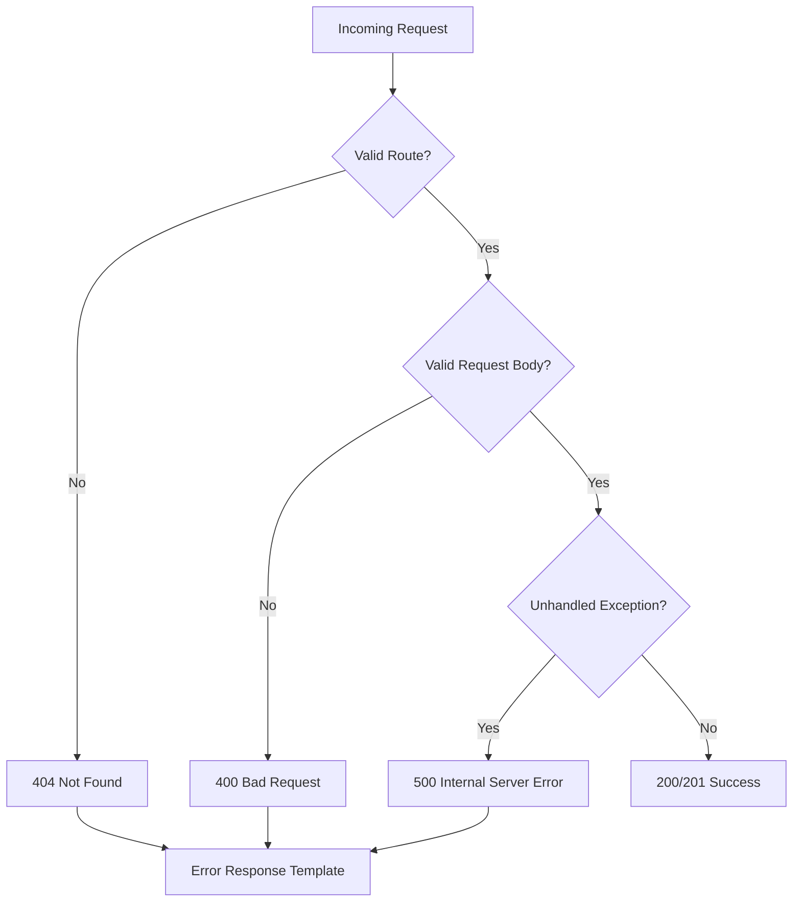

# NestJS Fastify Starter Kit

Backend starter kit built with NestJS and Fastify, designed for clean project bootstrap, consistent API responses, and scalable structure.


## Tags

`nestjs` `fastify` `typescript` `swagger` `drizzle` `vercel` `starter-kit` `api-template` `clean-architecture`

## Why This Starter

- High-performance HTTP engine with Fastify
- Structured and production-ready NestJS module layout
- Centralized response templates for success and error payloads
- Unified exception handling for predictable API contracts
- Flexible multi-database configuration strategy
- Built-in API documentation via Swagger

## Feature Snapshot

| Category     | What You Get                                   |
| ------------ | ---------------------------------------------- |
| Runtime      | NestJS 11 + Fastify adapter                    |
| API Docs     | Swagger UI at `/docs`                          |
| Config       | Environment-based app and DB config            |
| Data Layer   | Drizzle provider with SQL/NoSQL mode support   |
| API Contract | Global response interceptor + exception filter |
| Validation   | Global request validation pipe                 |
| Monitoring   | Health endpoint at `/health`                   |

## Architecture Flow



## Request Lifecycle



## Error Handling Flow (400 / 404 / 500)



## Project Structure

```text
src/
  common/
    filters/
      http-exception.filter.ts
    interceptors/
      response.interceptor.ts
    pipes/
      request-validation.pipe.ts
  database/
    database.config.ts
    database.module.ts
    database.types.ts
    drizzle.provider.ts
  health/
    health.controller.ts
    health.module.ts
  utils/
    response/
      index.ts
      response-template.util.ts
  app.controller.ts
  app.module.ts
  app.service.ts
  main.ts
```

## Quick Start

1. Install dependencies.

```bash
npm install
```

2. Create a local environment file.

```bash
cp .env.example .env
```

3. Run development mode.

```bash
npm run dev
```

4. Open endpoints.

- API Root: `http://localhost:3000/`
- Swagger: `http://localhost:3000/docs`
- Health: `http://localhost:3000/health`

## Bootstrap With NPX

Use this command to scaffold a new project from this starter:

```bash
npx create-nest-fastify-app my-api
```

For package owner (one-time setup before global NPX usage):

```bash
npm login
npm publish --access public
```

Local test without publishing:

```bash
npm link
npx create-nest-fastify-app my-api
```

## Starter cURL Commands

Quick smoke tests after running the server:

```bash
curl -X GET http://localhost:3000/
curl -X GET http://localhost:3000/health
curl -X GET http://localhost:3000/not-found
```

## Environment Variables

See `.env.example` for complete values.

### App

- `APP_NAME`
- `APP_DESCRIPTION`
- `APP_VERSION`
- `APP_ENV`
- `APP_PORT`

### Database Mode

- `DB_CLIENT=postgres`
- `DB_CLIENT=mysql`
- `DB_CLIENT=sqlite`
- `DB_CLIENT=nosql`

### SQL Settings

- `DB_URL`
- `DB_HOST`
- `DB_PORT`
- `DB_USER`
- `DB_PASSWORD`
- `DB_NAME`
- `DB_SSL`
- `DB_SQLITE_FILE`

### NoSQL Settings

- `NOSQL_PROVIDER`
- `NOSQL_URI`
- `NOSQL_DATABASE`

## Database Configuration Examples

PostgreSQL:

```env
DB_CLIENT=postgres
DB_HOST=localhost
DB_PORT=5432
DB_USER=postgres
DB_PASSWORD=postgres
DB_NAME=app_db
```

MySQL:

```env
DB_CLIENT=mysql
DB_HOST=localhost
DB_PORT=3306
DB_USER=root
DB_PASSWORD=secret
DB_NAME=app_db
```

SQLite:

```env
DB_CLIENT=sqlite
DB_SQLITE_FILE=./data/app.db
```

NoSQL Mode:

```env
DB_CLIENT=nosql
NOSQL_PROVIDER=mongodb
NOSQL_URI=mongodb://localhost:27017
NOSQL_DATABASE=app_nosql_db
```

## API Response Templates

Success payload:

```json
{
  "success": true,
  "statusCode": 200,
  "message": "OK",
  "path": "/health",
  "data": {
    "status": "ok"
  }
}
```

Error payload:

```json
{
  "success": false,
  "statusCode": 404,
  "message": "Cannot GET /unknown-route",
  "error": {
    "message": "Cannot GET /unknown-route",
    "error": "Not Found",
    "statusCode": 404
  },
  "path": "/unknown-route"
}
```

## Available Scripts

- `npm run dev` Start in watch mode
- `npm run build` Build to `dist`
- `npm run start` Start app
- `npm run start:debug` Start app in debug mode
- `npm run start:prod` Run compiled output
- `npm run lint` Run ESLint with autofix
- `npm run test` Run unit tests
- `npm run test:e2e` Run e2e tests

## Deployment Notes (Vercel)

- Keep Swagger assets stable in production with CDN URLs.
- Use relative OpenAPI URL for docs route compatibility.
- Ensure the latest commit is deployed before testing `/docs`.

## License

MIT License

Copyright (c) 2026 Nanda
